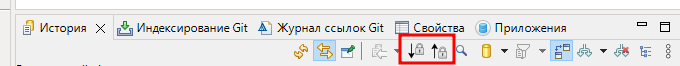
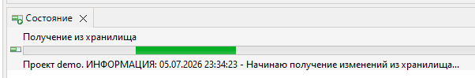
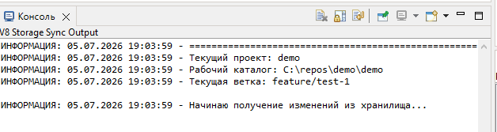
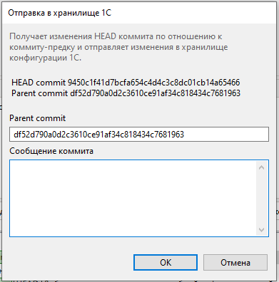

# V8 Storage Sync

Плагин для 1C:EDT, предоставляет пользовательский интерфейс для синхронизации проекта EDT с хранилищем конфигурации и выставляет интерфейс синхронизации для внешней утилиты синхронизации.

## Возможности

Плагин добавляет команды для синхронизации проекта EDT с хранилищем конфигурации 1С:

- **Получить из хранилища**
- **Отправить в хранилище**

Команды представлены в виде кнопок со стрелкой вверх/вниз и отображаются в окне История (History View).

Состояние выполнения синхронизации отображается в прогрессе окна Состояние.

В строке состояния выводится информация по шаблону: [Проект <ИмяПроекта>][<ПоследняяСтрокаЛога>]

Полный лог синхронизации выводится в Консоль

При отправке в хранилище открывается вспомогательное окно, в котором пользователь при необходимости указывает хэш коммита и вводит сообщение коммита.

По сути данный плагин выполняет роль адаптера, который предоставляет пользовательский интерфейс и интерфейс для внешней утилиты, в которую проксирует пользовательские команды, затем эта утилита и выполняет синхронизацию, кроме этого плагин выполняет контрольную функцию.

Связь с внешней утилитой устанавливается в настройках плагина: `Окно -> Параметры -> V8 Storage Sync`. Здесь указывается имя утилиты или путь к исполняемому файлу.

## Интерфейс синхронизации

## Команда `v8storage`

### `v8storage pull`
Подкоманда `pull`. Получает коммиты из хранилища, конвертирует полученные изменения в формат EDT и помещает в репозиторий проекта. Аргументов/опций не имеет.
### Пример
`v8storage pull`

### `v8storage push`
Подкоманда `push`. Получает изменения между коммитом HEAD и его предком и помещает изменения в хранилище конфигурации. Если HEAD находится на коммите слияния, то в качестве предка подбирается ближайший предок из merged branch, иначе берется первый предок из текущей ветки.

<table>
  <thead>
    <tr>
      <th style="width: 20%;">Опция</th>
      <th style="width: 10%;">Тип</th>
      <th style="width: 70%;">Описание</th>
    </tr>
  </thead>
  <tbody>
    <tr>
      <td><code>-h, --hash</code></td>
      <td>строка</td>
      <td>Идентификатор родительского коммита по отношению к коммиту HEAD. Обязательная.</td>
    </tr>
    <tr>
      <td><code>--message-stdin</code></td>
      <td>флаг</td>
      <td>Прочитать сообщение коммита из стандартного ввода (stdin). Обязательная.</td>
    </tr>
  </tbody>
</table>

### Пример
`v8storage push -h 7d038f9d18ea83a8351d89caab34011ca1a7485c --message-stdin`

## Утилита синхронизации Jewel Tools

Утилита реализует интерфейс синхронизации.

https://github.com/DmitryShehovtsev/jeweltools

## Установка плагина

### Установка по URL

1. Запустите 1C:EDT
2. Откройте **Справка -> Установить новое ПО...**
3. Нажмите **Добавить...**
4. Укажите:
   - **Имя**: `V8 Storage Sync`
   - **Расположение**: `https://DmitryShehovtsev.github.io/v8storagesync/`
5. Выберите **V8 Storage Sync**
6. Нажмите **Далее**
7. Примите лицензионное соглашение
8. Перезапустите EDT

### Установка из ZIP-архива

1. Скачайте ZIP-архив со страницы релизов
2. Откройте **Справка -> Установить новое ПО...**
3. Нажмите **Добавить...**
4. Нажмите **Архив...**
5. Выберите скачанный ZIP-файл
6. Выберите **V8 Storage Sync**
7. Нажмите **Далее**
8. Примите лицензионное соглашение
9. Перезапустите EDT

## Настройка

После установки плагина откройте: **Окно -> Параметры -> V8 Storage Sync**

Укажите имя команды или полный путь к внешнему инструменту синхронизации.

Значение по умолчанию: `jeweltools`

Сама утилита `jeweltools` должна быть установлена отдельно, см. раздел описания утилиты выше.

## Лицензия

Проект распространяется по лицензии **Eclipse Public License 2.0**.

Текст лицензии:

`https://www.eclipse.org/legal/epl-2.0/`

## Публикации

 [Синхронизация проекта 1C:EDT с хранилищем конфигурации](https://infostart.ru/public/2732922/)
